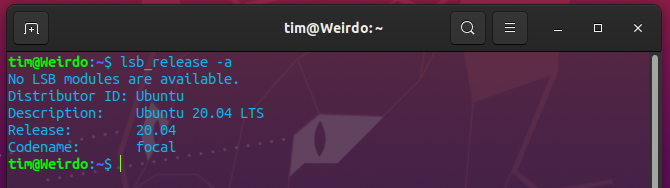

Code-it, Zetech University• Facebook Developers Circle Nairobi at Zetech University

# Week 1

## Github and Git Setup

### Github Account Setup

#### What is GitHub?

GitHub is a code hosting platform for version control and collaboration. It lets you and others work together on projects from anywhere.  
We will be using GitHub to host our code and share it as we continue with the Bootcamp.  
Use the Following resources to know more about GitHub:

- [https://guides.github.com/activities/hello-world/](https://guides.github.com/activities/hello-world/)
- [https://www.howtogeek.com/180167/htg-explains-what-is-github-and-what-do-geeks-use-it-for/](https://www.howtogeek.com/180167/htg-explains-what-is-github-and-what-do-geeks-use-it-for/)
- [https://www.edureka.co/blog/how-to-use-github/](https://www.edureka.co/blog/how-to-use-github/)

If you do not have a GitHub account, head over to [https://github.com/join](https://github.com/join) and create one.

Use the following resources:

- [https://docs.github.com/en/github/getting-started-with-github/signing-up-for-a-new-github-account](https://docs.github.com/en/github/getting-started-with-github/signing-up-for-a-new-github-account)
- [https://docs.aws.amazon.com/codedeploy/latest/userguide/tutorials-github-create-github-account.html](https://docs.aws.amazon.com/codedeploy/latest/userguide/tutorials-github-create-github-account.html)

### Git Setup

#### What is git ?

Git is a distributed version-control system for tracking changes in any set of files.  
A version control system - a system/software that tracks and manages changes to software code.

Installing git:  
[https://git-scm.com/downloads](https://git-scm.com/downloads)

Resources on installing git:  
[https://github.com/git-guides/install-git](https://github.com/git-guides/install-git)
[https://git-scm.com/book/en/v2/Getting-Started-Installing-Git](https://git-scm.com/book/en/v2/Getting-Started-Installing-Git)
[https://www.atlassian.com/git/tutorials/install-git](https://www.atlassian.com/git/tutorials/install-git)

Note:

For Windows users, ensure you have Git Bash installed.  
[https://www.atlassian.com/git/tutorials/git-bash](https://www.atlassian.com/git/tutorials/git-bash)

#### Git Commands

Learn basic terminal/git bash commands:

[https://git-scm.com/book/en/v2/Getting-Started-The-Command-Line](https://git-scm.com/book/en/v2/Getting-Started-The-Command-Line)
[https://docs.gitlab.com/ee/gitlab-basics/start-using-git.html](https://docs.gitlab.com/ee/gitlab-basics/start-using-git.html)

### Configuring Git and GitHub

For this section, use the article below:
[https://chrisdev.hashnode.dev/git-and-github-installation-and-configuration](https://chrisdev.hashnode.dev/git-and-github-installation-and-configuration)

### Activity

Use The file to get the activity after completing the setup:  
[https://github.com/ZetechUni/python/blob/main/docs/git-github-setup.md](https://github.com/ZetechUni/python/blob/main/docs/git-github-setup.md)

## Python Setup

### What is Python?

Python is a general-purpose, dynamic, high level, and interpreted programming language.  
Python 3 supports Object Oriented programming approach to develop applications. It is simple and easy to learn and provides lots of high-level data structures.  
Python is easy to learn yet powerful and versatile scripting language, which makes it attractive for Application Development.  
Python supports multiple programming pattern, including object-oriented, imperative, and functional or procedural programming styles.  

Use the following resources to know more about Python:

- [Python Official Documentation](https://www.python.org/)
- [RealPython Tutorials](https://realpython.com/tutorials/basics/)
- [W3Schools - Python Intro](https://www.w3schools.com/python/python_intro.asp)

### Installing Python

To start working with python3, one needs access to the Python Interpreter, this can be accomplished in four different ways depending on the operating system:  

1. It can be downloaded from the Python Foundation Software Website, then run on your machine.
2. Some Linux operating systems provide a Package Installer that can be run to install python.
3. Homebrew is the most prefered package installer to use on macOS to install python3.

On mobile operating systems like Android and iOS, you can install apps that provide a Python programming environment to practice your coding skills on the go.

#### Windows

Note that windows distributions do not ship with python.

1. Download the Python 3 Installer

   - Open a browser window and navigate to the [download page](https://www.python.org/downloads/) for Windows at [python.org](http://python.org/).
   - Underneath the heading at the top that says Python Releases for Windows, click on the link for the Latest Python 3 Release - Python 3.x.x.
   - Scroll to the bottom and select either Windows x86-64 executable installer for 64-bit or Windows x86 executable installer for 32-bit.

2. Run installer

   - Once you have chosen and downloaded an installer, simply run it by double-clicking on the downloaded file. Python Installer
   - You want to be sure to check the box that says:  
    *Add Python 3.x to PATH as shown to ensure that the interpreter will be placed in your execution path.*
   - Then just click Install Now. That should be all there is to it. A few minutes later you should have a working Python 3 installation on your system.

#### Linux

Note that most if not all Linux distributions come with ***Python already installed***. It is however most likely that it is not the latest version(Python 2).
To find out which version is installed, run either of the following commands:

1. `python --version`
2. `python2 --version`
3. `python3 --version`

If the version shown is Python 2.x.x or Python 3.x.x that is not the latest(Python 3.8.2 of this writing), then you would want to install the latest version.  
The procedure for doing this will depend on the Linux distribution you are running. To find out the version you are using run:  

#### Ubuntu/Linux Mint

Note that Mint and Ubuntu use the same package management system, therefore they share most commands.  
Depending on the version number you see under Release in the console output, follow the instructions below:

- Ubuntu 17.10, Ubuntu 18.04 (and above) come with Python 3.8 by default. You should be able to invoke it with the command python3.
- Ubuntu 16.10 and 17.04 do not come with Python 3.8 by default, but it is in the Universe repository. You should be able to install it with the following commands

>>> `~$ sudo apt-get update`  
>>> `~$ sudo apt-get install python3.8`

#### Fedora

Fedora has a roadmap to switch to Python 3 as the default Python [published here](http://fedoraproject.org/wiki/FinalizingFedoraSwitchtoPython3). It indicates that the current version and the next few versions will all ship with Python 2 as the default, but Python 3 will be installed. If the python3 installed on your version is not 3.6, you can use the following command to install it:  
> `~$ sudo dnf install python36`

#### Arch Linux

Arch Linux is fairly aggressive about keeping up with Python releases. It is likely you already have the latest version. If not, you can use this command:  
> `~$ packman -S python`

#### Debian

Debian generally does not install the sudo command by default. To install it, you’ll need to do the following before you carry out the Compiling Python From Source.  
Below is how to do that:

> `~$ su`  
> `~$ apt-get install sudo`  
> `~$ vi /etc/sudoers`  

After that, open the /etc/sudoers file using the sudo vim command (or your favourite text editor.) Add the following line of text to the end of the file, replacing your_username with your actual username: `your_username ALL=(ALL) ALL`

#### Android/iOS

If you have an Android tablet or phone and want to practice Python on the go, there are several options available.  
The one that most reliably supports Python 3.6 is **Pydroid 3**.  
Pydroid 3 features an interpreter you can use for REPL sessions, and it also provides the ability to edit, save, and execute Python code.

Options:

1. [Pydroid 3](https://play.google.com/store/apps/details?id=ru.iiec.pydroid3)
2. [QPython 3L](https://play.google.com/store/apps/details?id=org.qpython.qpy3)
3. [Pyonic Python3 Interpreter](https://play.google.com/store/apps/details?id=net.inclem.pyonicinterpreter3)

## Code Editor Setup

What Are IDEs and Code Editors?  
An IDE (or Integrated Development Environment) is a program dedicated to software development. As the name implies, IDEs integrate several tools specifically designed for software development. These tools usually include:

- An editor designed to handle code (with, for example, syntax highlighting and auto-completion)
- Build, execution, and debugging tools
- Some form of source control

### Common Editors

These are some of the most suitable code editors:

1. Visual Studio Code (recommended)
2. PyCharm
3. Sublime Text
4. Atom
5. Vim

### Activity

Install your favourite code editor and configure Python to run on/work with the editor. You do not need to submit any evidence of completion for this activity, however, failure to set up Python means you won’t be able to follow the next activities.

## Python Basics

All source codes can be [found here​](./source) (feel free to clone the repository).

### Print Keyword

The print function allows you to send output to the terminal.Strings can be enclosed in single quotes or double quotes.  
[EXPLANATIONS AND PRACTICE CODE](./source/print)

### Variables

#### Variables: Numeric

Python can store and manipulate numbers. Python has two types of numeric values: integers (whole numbers) or float (numbers with decimal places)  
[Numeric types in python](https://docs.python.org/3/library/stdtypes.html#numeric-types-int-float-complex)

#### Variables: String

Python can store and manipulate strings. Strings can be enclosed in single or double-quotes. There are a number of string methods you can use to manipulate and work with strings.  
[EXPLANATIONS AND PRACTICE CODE](./source/variables)

### Dates

The [datetime module](https://docs.python.org/3/library/datetime.html) contains a number of classes for manipulating dates and times.  
Date and time types:

- `date` stores year, month, and day
- `time` stores hour, minute, and second
- `datetime` stores year, month, day, hour, minute, and second
- `timedelta` a duration of time between two dates, times, or datetimes

[EXPLANATIONS AND PRACTICE CODES](./source/dates)

## Resources

[Getting started with Python](https://www.python.org/about/gettingstarted/)
[Print​](https://docs.python.org/3/library/functions.html#print) - keyword
